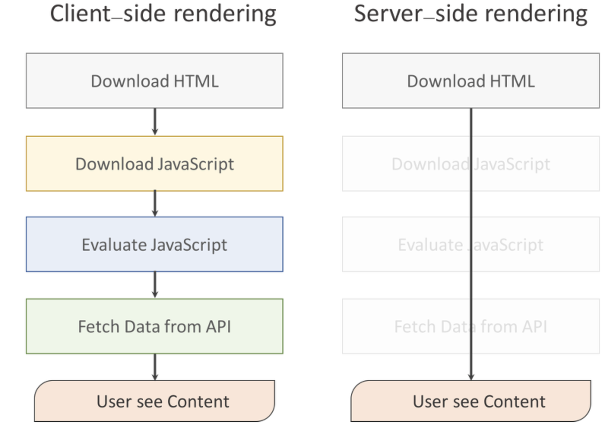
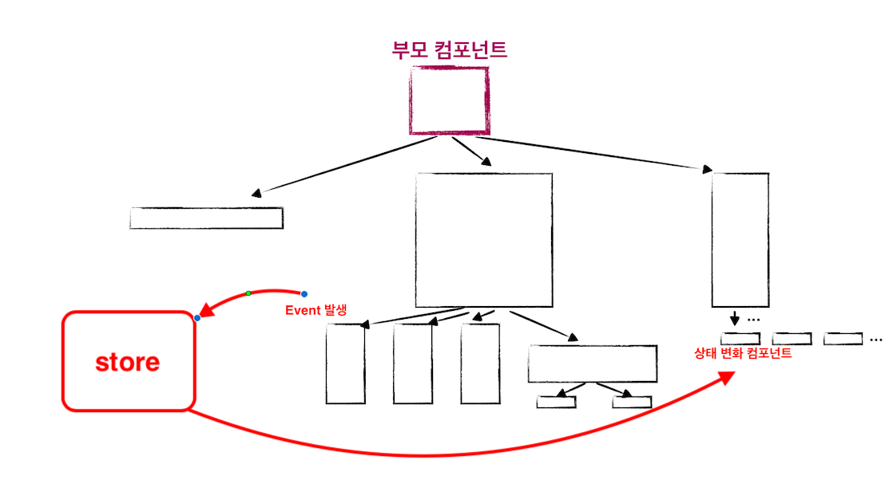
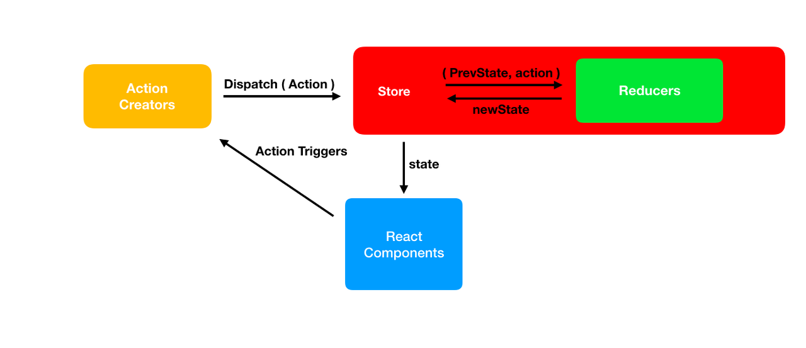
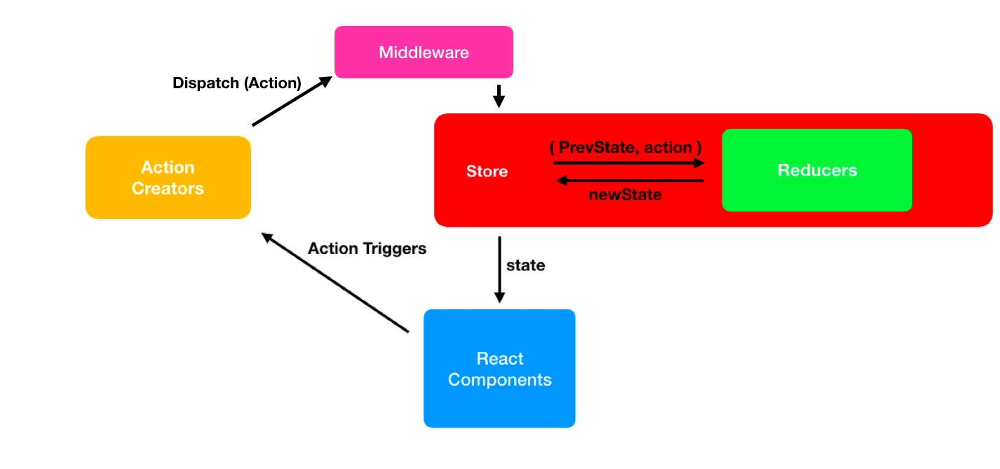

# Today I Learn

## 목표

- 공부한 내용 기록
- 2문제 이상 알고리즘 문제 풀기

## 8 月

### 2 日

- MPA

  - `Multi Page Application`의 약자로 전통적인 방식으로 브라우저에서 데이터를 보여주거나 데이터를 서버에게 전달할때마다 화면이 전환된다
  - 옛날엔 문서 하나에 전달되는 파일의 용량이 적었으나 현대에 이르러 점차 웹 사이트가 고도화됨에 따라 한 페이지에 해당하는 페이지 용량이 커져갔고, 매번 새로운 페이지를 전달하는게 버거워지게 되었다

- SPA

  - `Single Page Application`의 약자로 MPA의 문제를 해결하기 위해 생겼고 웹 사이트의 전체 페이지를 하나의 페이지에 담아 동적으로 화면을 바꿔가며 표현하는 애플리케이션으로 `Client-Side Rendering` 방식이다
  - 이벤트가 발생하면 상호작용하기 위한 최소한의 요소만 변경이 일어나고 페이지 변경이 일어난다고 보여지는 것 또한 최초 로드된 자바스크립트를 통해 미리 브라우저에 올라간 템플릿만 교체되는 것이다
  - 장점
    - 빠르다
    - 대부분의 리소스를 애플리케이션에 들어오는 시점에 딱 한 번 로딩하며 데이터는 나중에 불러온다
    - 서버에서 페이지를 렌더링하는 코드를 짤 필요가 없고 서버에서 파일을 요청하는 것 없이도 화면 개발을 더욱 쉽게 할 수 있다
  - 단점
    - 데이터가 `AJAX`로 로딩되기 때문에 SEO최적화하기 쉽지 않고 까다롭다
    - 다운로드 받는게 느리고 `Javascript`가 보여지고 사용되기를 요구하기 때문에 사용자가 `Javascript`를 사용되지 않도록 설정하면 애플리케이션에서 아무것도 안 보이고 동작하지 않는다  
      (Server-Side Rendering을 사용하면 해결 가능하다)

- Rendering

  - 요청받은 내용을 브라우저 화면에 표시하는 것이다



- Client-Side Rendering

  - `SPA`로, 클라이언트 사이드에서 HTML을 반환한 후에, JS가 동작하면서 데이터만을 주고 받아서 클라이언트에서 렌더링을 진행하는 것
  - 동작 과정 : HTML 다운로드 -> JS 다운로드 -> JS 실행 -> DATA 서버로부터 받기 -> Content 확인
  - 장점
    - 사용자의 행동에 따라 필요한 부분만 다시 읽어들이기때문에 SSR보다 조금 더 빠른 인터렉션이 가능하다
    - 페이지에 필요한 부분만 변경되기 때문에, 모바일 네트워크에서도 빠른 속도로 렌더링이 가능하다
    - lazy loading을 지원한다  
      lazy loading : 페이지 로딩시 중요하지 않은 리소스의 로딩을 늦추는 기술
      (ex. 스크롤을 내려야만 해당 이미지가 보이게 하는 것)
    - 서버사이드 렌더링이 따로 필요하지 않기 때문에 일관성 있는 코드를 작성할 수 있다
  - 단점
    - 브라우저 없이 html만 가져와서 Googlebot과 Searchconsole에 검색 노출 되지 않는다
    - 페이지를 읽고, 자바스크립트를 읽은 후 화면을 그리는 시간까지 모두 마쳐야 콘텐츠가 사용자에게 보여지기 때문에 초기 구동 속도가 느리다

- Server-Side Rendering

  - `Server-Side Script` 언어 기반의 템플릿 엔진을 이용해 동적인 웹 콘첸츠를 만드는 방식이다
  - 장점
    - 사용자가 처음으로 콘텐츠를 볼 수 있는 시점을 앞당길 수 있다
    - SEO(Search Engine Optimization) 적용이 용이하다
  - 단점
    - 모든 요청에 관해 필요한 부분만 수정하는 것이 아니라 완전히 새로운 페이지를 로딩하고 렌더링해준다
    - 전체를 로딩하다 보니 CSR보다 느리다

### 5 日

- 미들웨어

  - 응용 소프트웨어가 운영체제로부터 제공받는 서비스 이외에 추가적으로 이용할 수 있는 서비스를 제공하는 컴퓨터 소프트웨어
  - 응용 소프트웨어는 유연하고 확장, 축소가 편리해야하며 이러한 장점을 충족하기에 개발자의 다른 기종간 플랫폼을 다시 구축할 필요가 없어야 한다  
    (ex. 데이터베이스 시스템, 전자통신 소프트웨어, 메시지 및 쿼리 처리 소프트웨어)
  - 양 쪽을 연결하여 데이터를 주고 받을 수 있도록 중간에서 매개 역할을 하는 소프트웨어
  - 네트워크를 통해서 연결된 여러 개의 컴퓨터에 있는 많은 프로세스들에게 어떤 서비스를 사용할 수 있도록 연결해주는 소프트웨어
  - 장점
    - 표준화된 인터페이스 제공 가능
    - 다양한 환경 지원, 체계가 다른 업무와 상호 연동 가능
    - 분산된 업무를 동시에 처리 가능하여 자료의 일관성이 유지
    - 부하의 분산이 가능
  - 종류
    - 원격 프로시저 호출(Remote Procedure Call, RPC) : 클라이언트가 원격에서 동작하는 프로시저를 호출하는 시스템으로 동기·비동기 지원
    - 메시지 지향 미들웨어(Message Oriented Middleware, MOM) : 클라이언트가 생성한 메시지는 저장소에 요청할 때 저장하면서, 다른 업무를 지속할 수 있또록 하는 비동기식 미들웨어
    - ORB(Object Request Broker) : 객체지향 시스템에서 객체 및 서비스를 욫어하고 전송할 수 있도록 지원하는 미들웨어
    - DB 접속 미들웨어 : 애플리케이션과 데이터베이스 서버를 연결해주는 미들웨어

- Redux

  - 자바스크립트 애플리케이션에서 `상태를 효율적으로 관리`할 수 있게 도와주는 도구
  - 복잡한 상태 관리가 이루어지는 SPA(Single Page Application)에서 유용하게 사용되며 리액트 뿐만 아니라 jQuery, Angular 등을 사용하는 애플리케이션에서도 사용한다
  - 리액트를 사용할 때 상태 관리는 매우 중요한 요소 중 하나로 리액트로 만들 수 있는 SPA는 data 혹은 UI의 변화가 복잡, 다양해지는 경우가 많아지는데 리덕스는 이를 효율적으로 관리할 수 있게 해주는 도구다  
       
    위와 같이 스토어를 사용하여 상태를 컴포넌트 구조 바깥에 두고 스토어라는 중간자를 통해 상태를 업데이트하거나 새로운 상태를 전달 받는다 즉 상태값을 컴포넌트에 종속시키지 않고 상태관리를 바깥에서 할 수 있게 해준다

  - WorkFlow

    

    - Action  
      상태의 변화가 필요할 때, 우리는 액션을 발생시키는데 이 액션은 하나의 객체로 표현된다
      ```
      {
        type: "ADD_TODO",
        data: {
          id: 0,
          text: "redux"
        }
      }
      ```
      액션은 Type 이라는 필드를 필수적으로 가지고 있어야하고, 추가적으로 필요한 객체의 요소들은 필요에 의해 추가할 수 있다
    - Action Creator  
      액션 생성함수라 불리는 Action Creator는 액션을 만드는 함수로 파라미터를 입력받아 액션 객체 형태로 만들어준다
      ```
      function addTodo(data) {
        return {
          type: "ADD_TODO",
          data
        }
      }
      ```
    - Reducer  
      리듀서는 변화를 일으키는 함수로 이전 상태와 액션을 파라미터로 받으며 반호나값은 로직에 의해 변화된 상태값을 반환한다
      ```
      function reducer(state, action) {
        ...
        return alteredState;
      }
      ```
    - Store  
      스토어는 컴포넌트 외부에 있는 상태 저장소로, 안에는 현재 상태들, 리듀서, 몇 가지의 내장 함수를 포함하고 있다
    - Dispatch  
      디스패치는 스토어의 내장함수 중 하나로, 액션을 발생시키는 역할을 한다

### 8 日

- 리덕스 미들웨어

  - 액션을 디스패치 했을 때 리듀서에서 이를 처기하기 전에 지정된 작업들을 실행할 수 있게 해주는 것으로 액션과 리듀서 사이의 중간자라고 볼 수 있다
  - 전달받은 액션을 콘솔에 기록하거나, 전달받은 액션 정보를 기반으로 액션을 취소하거나, 다른 종류의 액션을 추가하는 등 다양한 역할을 담당할 수 있으며 구조는 아래와 같다

  ```
  const loggerMiddleware = store => next => action {
    //
  }

  const loggerMiddleware = function loggerMiddleware(store) {
    return funtion(next) {
      return function(action) {
        //
      }
    }
  }


  export default loggerMiddleware;
  ```

  - 필요한 이유

    - 우리가 알고 있는 리덕스는 동기적인 흐름을 통해 동작하는데 동기적인 흐름만으로는 처리하기 힘든 작업들이 있다. 이때 비동기 작업을 처리하는데 있어 리덕스 미들웨어를 주로 사용한다

  - WorkFlow

  

  - 대표적인 미들웨어
    - redux-thunk
    - redux-saga : 특정 액션이 디스패치 되었을 때 정해진 로직에 따라 다른 액션을 디스패치시키는 규칙을 작성하여 비동기 작업을 처리할 수 있게 해준다
