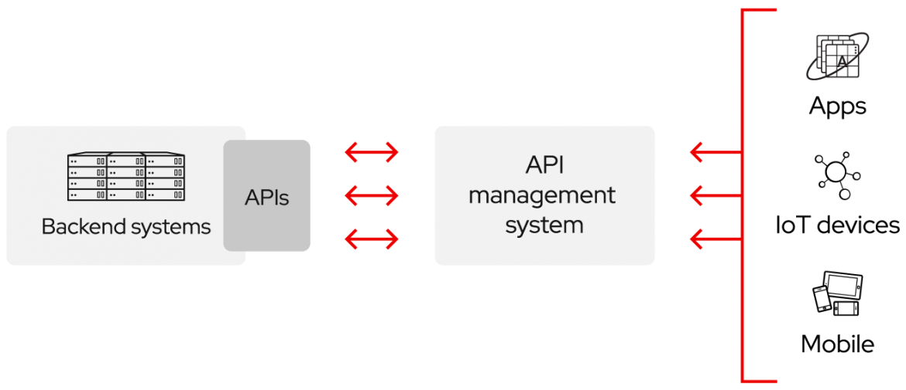

# Today I Learn

## 목표

- 공부한 내용 기록
- 2문제 이상 알고리즘 문제 풀기

## 7 月

### 29 日

- API

  - `API(Application Programming Interface)`는 애플리케이션 소프트웨어를 구축하고 `통합`하기 위한 정의 및 프로토콜 세트다
  - 구현 방식을 알지 못해도 제품 또는 서비스가 서로 커뮤니케이션할 수 있으며 애플리케이션 개발을 간소화하여 시간과 비용을 절약할 수 있다
  - 클라우드 네이티브 애플리케이션 개발을 통해 자체 인프라를 연결하는 간소화된 방식이지만 고객 및 다른 외부 사용자와의 데이터 공유를 허용하기도 한다
  - 퍼블릭 API는 파트너와의 연결 방식을 간소화하고 확대할 수 있을 뿐만 아니라 보유한 데이터를 활용해 수익을 창출할 수 있기 때문에 고유의 비즈니스 가치를 지닌다(ex. Google Maps API)
    
  - API 릴리스 정책은 내부용(Private), 파트너용(Partner), 공용(Public) 세 가지 접근 방식을 취한다
  - API 공유를 선택하면 다음과 같은 이점들을 누릴 수 있다
    - 새로운 수익 채널 확보
    - 기존 수익 채널 확장
    - 브랜드 인지도 확대
    - 외부 개발 및 협업을 통한 오픈 혁신 촉진 및 효율성

- REST

  - `Representational State Transfer`의 약자로 자원을 이름(자원의 표현)으로 구분하여 해당 자원의 상태(정보)를 주고 받는 모든 것을 의미한다

    - 자원의 표현에 의한 상태 전달
      - 자원 : 해당 소프트웨어가 관리하는 모든 것 (ex. 문서, 그림, 데이터, 해당 소프트웨어 자체 등)
      - 자원의 표현 : 자원을 표현하기 위한 이름 (ex. DB의 학생 정보가 자원일 때 'student'를 자원의 표현으로 정한다)
    - 상태 전달
      - 데이터가 요청되어지는 시점에서 자원의 상태(정보)를 전달한다
      - JSON 혹은 XML를 통해 데이터를 주고 받는 것이 일반적이다

  - WWW(World Wide Web)과 같은 분산 하이퍼미디어 시스템을 위한 소프트웨어 개발 아키텍처의 한 형식

    - REST는 기본적으로 웹의 기존 기술과 HTTP 프로토콜을 그대로 활용하기 때문에 웹의 장점을 최대한 활용할 수 있는 아키텍처 스타일이다
    - 네트워크 상에서 Client와 Server 사이의 통신 방식 중 하나이다

  - HTTP URI를 통해 자원을 명시하고 HTTP METHOD를 통해 해당 자원에 대한 CRUD Operation을 적용하는 것을 의미한다

    - CRUD Operation

      - Create : 생성(POST)
      - READ : 조회(GET)
      - Update : 수정(PUT)
      - Delete : 삭제(DELETE)
      - HEAD : header 정보 조회(HEAD)

    - 장점

      - HTTP 프로토콜의 인프라를 그대로 사용하므로 REST API 사용을 위한 별도의 인프라를 구축할 필요가 없다
      - HTTP 프로토콜의 표준을 최대한 활용하여 여러 추가적인 장점을 함께 가져갈 수 있게 해준다
      - HTTP 표준 프로토콜에 따르는 모든 플랫폼에서 사용이 가능하다
      - Hypermedia API의 기본을 충실히 지키면서 범용성을 보장한다
      - REST API 메시지가 의도하는 바를 명확하게 나타내므로 의도하는 바를 쉽게 파악할 수 있다
      - 여러가지 서비스 디자인에서 생길 수 있는 문제를 최소화한다
      - 서버와 클라이언트의 역할을 명확하게 분리한다

    - 단점

      - 표준이 존재하지 않는다
      - 사용할 수 있는 메소드가 4가지 밖에 없어 HTTP Method 형태가 제한적이다
      - 브라우저를 통해 테스트할 일이 많은 서비스라면 쉽게 고칠 수 있는 URL보다 Header 값이 왠지 더 어렵게 느껴진다
      - 구형 브라우저가 아직 제대로 지원해주지 못하는 부분(PUT, DELETE, pushState 등)이 존재한다

    - 구성요소

      - 자원(Resource) : URI
        - 모든 자원에 고유한 ID가 존재하고 이 자원은 Server에 존재한다
        - 자원을 구별하는 ID는 /groups/:group_id와 같은 HTTP URI다
        - Client는 URI를 이용해서 자원을 지정하고 해당 자원의 상태에 대한 조작을 Server에 요청한다
      - 행위(Verb) : HTTP Method
        - HTTP 프로토콜의 Method를 사용한다
        - HTTP 프로토콜은 GET, POST, PUT, DELETE와 같은 메서드를 제공한다
      - 표현(Representation of Resource)
        - Client가 자원의 상태에 대한 조작을 요청하면 Server는 이에 적절한 응답을 보낸다
        - REST에서 하나의 자원은 `JSON`, `XML`, `TEXT`, `RSS` 등 여러 형태의 표현으로 나타내어 질 수 있다
        - `JSON` 혹은 `XML`를 통해 데이터를 주고 받는 것이 일반적이다

    - 특징
      - Uniform Interface
        - URI로 지정한 리소스에 대한 조작을 통일되고 한정적인 인터페이스로 수행하는 아키텍처 스타일을 말한다
      - Stateless(무상태성)
        - 작업을 위한 상태정보를 따로 저장하고 관리하지 않는다. 세션 정보나 쿠키정보를 별도로 저장하고 관리하지 않기 때문에 API 서버는 들어오는 요청만을 단순히 처리하면 되고 때문에 서비스의 자유도가 높아지고 서버에서 불필요한 정보를 관리하지 않음으로써 구현이 단순해진다
      - Cacheable(캐시 처리 가능)
        - HTTP라는 기존 웹표준을 그대로 사용하기 때문에 웹에서 사용하는 기존 인프라를 그대로 활용이 가능하다. 그래서 HTTP가 가진 캐싱 기능이 적용 가능하하며 HTTP 프로토콜 표준에서 사용하는 Last-Modified 태그나 E-Tag를 이용하면 캐싱 구현이 가능하다
      - Self-descriptiveness(자체 표현 구조)
        - REST API 메시지만 보고도 이를 쉽게 이해할 수 있는 자체 표현 구조로 되어 있다
      - Client-Server 구조
        - REST 서버는 API 제공, 클아이언트는 사용자 인증이나 컨텍스트 등을 직접 관리하는 구조로 각각의 역할이 확실히 구분되기 때문에 클라이언트와 서버에서 개발해야 할 내용이 명확해지고 서로간 의존성이 줄어들게 됩니다
      - 계층형 구조
        - REST 서버는 다중 계층으로 구성될 수 있으며 보안, 로드 밸런싱, 암호화 계층을 추가해 구조상의 유연성을 둘 수 있고 PROXY, 게이트웨이 같은 네트워크 기반으 ㅣ중간매체를 사용할 수 있게 한다

- REST API

  - `REST` 기반으로 서비스 `API`를 구현한 것
  - 사내 시스템들도 REST 기반으로 시스템을 분산해 확장성과 재사용성을 높여 유지보수 및 운용르 편리하게 할 수 있다
  - REST는 HTTP 표준을 기반으로 구현하므로 HTTP를 지원하는 프로글매 언어로 클라이언트, 서버를 구현할 수 있으며 REST API를 제작하면 델파이 클라이언트 뿐 아니라 자바, C#, 웹 등을 이용해 클라이언트를 제작할 수 있다

  - REST API 설계 기본 규칙

    - URI는 정보의 자원을 표현해야 한다
    - 자원에 대한 행위는 HTTP Method(GET, POST, PUT, DELETE)로 표현한다

      - URI에 행위에 대한 동사 표현이 들어가면 안된다
      - (ex. `GET /members/show/1` -> `GET /members/1`)

    - `POST`, `GET`, `PUT`, `DELETE` Method를 가지고 `CRUD`를 할 수 있다

    | METHOD | 역할                                                                          |
    | :----: | :---------------------------------------------------------------------------- |
    |  POST  | POST를 통해 해당 URI를 요청하면 리소스를 생성합니다                           |
    |  GET   | GET을 통해 해당 리소스를 조회하고 해당 도큐먼트에 대한 자세한 정보를 가져온다 |
    |  PUT   | PUT을 통해 해당 리소스를 수정합니다                                           |
    | DELETE | DELETE를 통해 리소스를 삭제합니다                                             |

  - REST API 설계 규칙

    - 슬래시 구분자(/)는 계층 관계를 나타내는데 사용한다
    - URI 마지막 문자로 슬래시(/)를 포함하지 않는다
    - 하이픈(-)은 URI 가독성을 높이는데 사용
    - 밑줄(\_)은 URI에 사용하지 않는다
    - URI 경로에는 소문자가 적합하다
    - 파일확장자는 URI에 포함하지 않는다
    - 리소스 간에는 연관 관계가 있는 경우
      - /리소스명/리소스 ID/관계가 있는 다른 리소스명
      - Ex. `GET : /users/{userid}/devices (일반적으로 소유 'has'의 관계를 표현할 때)`

  - 응답코드

  | 상태코드 |                                                                                                         |
  | :------: | :------------------------------------------------------------------------------------------------------ |
  |   200    | 클라이언트의 요청을 정상적으로 수행함                                                                   |
  |   201    | 클라이언트가 어떠한 리소스 생성을 요청, 해당 리소스가 성공적으로 생성됨(POST를 통한 리소스 생성 작업시) |
  |   301    | 클라이언트가 요청한 리소스에 대한 URI가 변경되었을 때 사용하는 응답코드                                 |
  |          | (응답 시 Location header에 변경된 URI를 적어줘야 한다)                                                  |
  |   400    | 클라이언트의 요청이 부적절 할 경우 사용하는 응답 코드                                                   |
  |   401    | 클라이언트가 인증되지 않은 상태에서 보호된 리소스를 요청했을 때 사용하는 응답 코드                      |
  |          | 로그인 하지 않은 유저가 로그인 했을 때, 요청 가능한 리소스를 요청 했을 때                               |
  |   403    | 유저 인증상태와 관계없이 응답하고 싶지 않은 리소스를 클라이언트가 요청했을 때 사용하는 응답 코드        |
  |          | (403 보다는 400이나 404를 사용할 것을 권고)                                                             |
  |   405    | 클라이언트가 요청한 리소스에서는 사용 불가능한 Method를 이용했을 경우 사용하는 응답 코드                |
  |   500    | 서버에 문제가 있을 경우 사용하는 응답 코드                                                              |

- RESTful

  - 일반적으로 REST라는 아키텍처를 구현하는 웹 서비스를 나타내기 위해 사용되는 용어
  - REST를 REST답게 쓰기 위한 방법으로 누군가가 공식적으로 발표한 것이 아니다
  - 이해하기 쉽고 사용하기 쉬운 REST API를 만드는 것이 목적으로 일관적인 컨벤션을 통한 API의 이해도 및 호환성을 높이는 것이 주 동기이니 성능이 중요한 상황에서는 굳이 RESTful한 API를 구현할 필요는 없다
