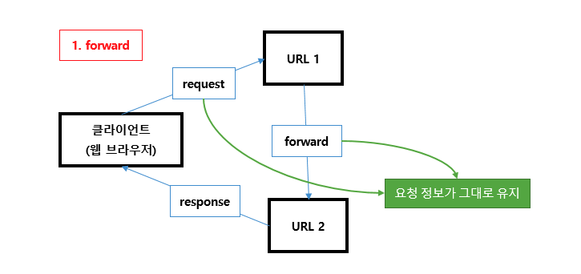

# Today I Learn
## 목표
* 공부한 내용 기록
* 2문제 이상 알고리즘 문제 풀기

## 6月

### 4日

- JSP(Java Server Page)

    - Java 언어를 기반으로 하는 Server Side 스크립트 언어
    - HTML 코드에 Java 코드를 넣어 동적인 웹 페이지를 생성하는 웹 어플리케이션들은 일반적으로 하나의 루트 DOM 노드가 있고 React를 기존 앱에 통합하려는 경우 원하는 만큼 많은 수의 독립된 루트 DOM 노드가 있을 수 있다 도구
    - Servlet를 보완한 스크립트 방식으로 Servlet의 모든 기능을 사용 가능
    - 동작 과정
        1. JSP가 실행되면 WAS는 내부적으로 JSP 파일을 Java Servlet으로 변환
        2. WAS는 이 변환한 Servlet을 동작하여 필요한 기능을 수행
        3. 수행 완료 후 생성된 데이터를 웹 페이지와 함께 클라이언트로 응답
    - 생명주기
        - Servlet 생명주기와 유사하다.   
        
    - 문법
        1. JSP Expression   
            **<%= expression %>**  
            JSP Expression element는 String으로 변환되어 Servlet의 출력에 삽입되며 동적인 페이지를 생성하고 끝에 세미콜론(;)을 붙이지 않는다
        2. JSP Scriptlet   
            **<% code fragment %>**   
            간단한 값이 아닌 복잡한 것을 수행하고자 할 때 사용한다   
            임의의 Java 코드를 삽입할 수 있으며 JSP Scriptlet Tag는 메소드가 아닌 변수만 선언할 수 있다
        3. JSP Declaration   
            **<%! declaration %>**   
            JSP Declaration을 사용하면 Servlet 클래스에 삽입되는 메소드나 필드를 정의할 수 있다
        4. JSP Comment   
            **<%-- comment --%>**   
            주석 기능
        5. JSP Directive   
            **<%@ directive %>**   
            JSP 페이지의 전체적인 구조에 영향을 미친다   
            전체 구조에 대해 WAS에 지시를 내리며 지시어에는 page, include, taglib가 들어간다   
               1. page    
               **<%@ page attribute = "value" %>**   
               - page 지시어는 Container에 명령을 제공하는데 사용된다   
               2. include   
               **<% include file = "relative_url" %>**   
               - include 지시어는 변환 단계에서 다른 외부 파일의 내용을 현재 JSP에 병합하도록 Container에 지시한다   
               - 웹 페이지에서 header와 footer의 구성은 거의 동일하기 때문에 외부에서 형식을 만든 후 include 지시어를 이용하여 main.jsp에 병합한다   
               3. taglib   
               **<% taglib uri = "uri" prefix = "prefixOfTag" %>**   
               - JSP API를 사용하면 HTML 또는 XML 태그처럼 보이는 사용자 정의 태그를 정의할 수 있다   
               - tag library는 사용자가 정의한 동작을 구현한 사용자 정의 태그 집합이다
        6. JSP Action   
            JSP Action XML 구문 안의 구조들을 사용하여 WAS의 동작을 제어한다   
               1. **< jsp:forward >** action   
               - 다른 리소스(JSP, html 또는 Servlet과 같은 정적 페이지)로 요청을 전달하는데 사용한다   
               2. **< jsp:include >** action   
               - 현재 JSP 페이지에 다른 리소스를 포함시키는데 사용한다
               3. **< jsp:useBean >** action   
               - 해당하는 Bean(자바 객체)이 존재하는지 확인하고 없으면 지정된 객체를 생성한다   
               4. **< jsp:setProperty >** action   
               - Bean의 속성을 설정한다   
               5. **< jsp:getProperty >** action   
               - 주어진 속성값을 가져오는데 사용되며 이를 문자열로 변호나하고 동적인 웹 페이지를 생성하는데 해당 내용을 사용할 수 있다
    - 호출 방법 (아래로 갈수록 복잡한 App 또는 큰 규모의 개발팀이 사용)
        1. Call Java code Directly
            - 모든 Java 코드를 JSP 페이지에 넣는 방식으로 아주 적은 양의 코드에만 적합한 전략
        2. Call Java code indirectly
            - 별도의 utility class를 작성하고 호출하는 데 필요한 Java 코드만 JSP 페이지에 넣는다
        3. Use beans
            - beans로 구조화된 별도의 utility class를 작성한 후 jsp:useBean, jsp:getProperty, jsp:setProperty를 사용하여 uility class를 호출한다
        4. Use the MVC architecture
            - Servlet(Controller)이 요청에 응답하고 적절한 데이터를 검색하여 결과를 beans(Model)에 저장하고 결과를 JSP 페이지(View)로 전달하여 결과를 표시한다
            
        5. Use the JSP expression Language
            - shorthand syntax를 이용하여 간단하게 객체 속성에 접근하고 출력한다
            - jsp:useBean, jsp:getProperty, jsp:setProperty를 expression language로 간단하게 표현할 수 있다
            - 일반적으로  beans, MVC 패턴을 함께 사용
        6. Use custom tags
            - tag handler class를 만들고 XML과 같은 사용자 정의 태그를 사용하여 태그 핸들러를 호출한다
        

### 5日

- 리다이렉트(Redirect)

    - HTTP프로토콜로 정해진 규칙으로 서버는 클라이언트의 요청에 대해 특정 URL로 이동을 요청할 수 있는데 이를 리다이렉트라고 한다
    - 서버는 클라이언트에게 HTTP 상태코드 302로 응답할 때 헤더 내 Location 값에 이동할 URL을 추가하고 응답을 받은 클라이언트는 헤더(Location)에 포함된 URL로 재요청을 보내게 되고 이때 브라우저의 주소창은 새 URL로 바뀌게 된다
    - 클라이언트는 서버로부터 받은 상태 값이 302이면 Location 헤더값으로 재요청을 보내게 되고 이때 브라우저의 주소창은 전송받은 URL로 바뀌게 된다
    - 서블릿이나 JSP는 리다이렉트 하기 위해 HttpServletResponse 클래스의 sendRedirect() 메소드를 사용한다
    

- 포워드(Forward)

    - 웹 컨테이너 차원에서 페이지 이동만 있는 것으로 웹 브라우저는 다른 페이지로 이동을 했는지 알 수 없어 최초에 호출한 URL이 표시된다
    - 클라이언트와 통신 없이 서버에서만 처리되는 것이기 때문에 리다이렉트보다 나은 성능을 보여준다
    - 현재 실행중인 페이지와 포워딩에 의해 호출되는 Request와 Response 객체를 공유하고 객체를 Request에 담아 다음 자원에 전송한다
    


### 7日

- Scope
    
    

    - Application : 웹 어플리케이션이 시작되고 종료될 때까지 변수가 유지되는 경우 사용
    - Session : 웹 브라우저 별로 변수가 관리되는 경우 사용
    - Request : http 요청을 WAS가 받아서 웹 브라우저에게 응답할 때까지 변수가 유지되는 경우 사용
    - Page : 페이지 내에서 지역변수처럼 사용

-  Page Scope

    - PageContext 추상 클래스를 사용하며 JSP 페이지에서 pageContext 내장 객체로 사용 가능
    - forward가 될 경우 해당 Page scope에 지정된 변수는 사용할 수 없다
    - 사용방법은 Application scope나 Session scope, request scope와 같으나 지역변수처럼 사용된다는 것이 다른 scope들과 다르다
    - jsp에서 pageScope에 값을 저장한 후 해당 값을 EL표기법 등에서 사용할 때 사용한다
    - 지역 변수처럼 해당 jsp나 서블릿이 실행되는 동안에만 정보를 유지하고자 할 때 사용한다

- Request Scope

    - http 요청을 WAS가 받아서 웹 브라우저에게 응답할 때까지 변수값을 유지하고자 할 경우 사용한다
    - JSP에서는 request 내장 변수를 서블릿에서는 HttpServletRequest 객체를 사용한다
    - 값을 저장할 때는 request 객체의 setAttribute() 메소드를 읽어 들일 때는 request 객체의 getAttribute() 메소드를 사용한다

- Session Scope

    - 웹 브라우저별로 변수를 관리하고자 할 경우 사용한다
    - 웹 브라우저간의 탭 간에는 세션정보가 공유되기 때문에, 각각의 탭에서는 같은 세션정보를 사용할 수 있다
    - HttpSession 인터페이스를 구현한 객체를 사용하며 JSP에서는 session 내장 변수를 서블릿에서는 HttpServletRequest의 getSession() 메소드를 이용하여 session 객체를 얻는다
    - 값을 저장할 때는 session 객체의 setAttribute() 메소드를 값을 읽어 들일 때는 session 객체의 getAttribute()메소드를 사용한다
    - 장바구니처럼 사용자별로 유지가 되어야 할 정보가 있을 때 사용한다

- Application Scope

    - 웹 어플리케이션이 시작되고 종료될 때까지 변수를 사용할 수 있다
    - ServletContext 인터페이스를 구현한 객체를 사용하며 JSP 에서는 applcation 내장 객체를 서블릿에서는 getServletContext() 메소드를 이용하여 application 객체를 이용한다
    - 웹 어플리케이션들은 일반적으로 하나의 루트 DOM 노드가 있고 React를 기존 앱에 통합하려는 경우 원하는 만큼 많은 수의 독립된 루트 DOM 노드가 있을 수 있다 하나당 하나의 application객체가 사용된다
    - 값을 저장할 때는 application객체의 setAttribute()메소드를 값을 읽어 들일 때는 application객체의 getAttribute()메소드를 사용한다
    - 모든 클라이언트가 공통으로 사용해야 할 값들이 있을 때 사용한다


### 8日

- JSX

    - 리액트에서 생김새를 정의할 때 사용하는 문법으로 XML 형태로 코드를 작성하면 babel이 JavaScript로 변환을 해준다
    - Babel은 JS의 문법을 확장해주는 도구로 아직 지원되지 않는 최신 문법, 편의상 사용하거나 실험적인 JS 문법들을 정식 JS 형태로 변환해줌으로서 제대로 실행할 수 있게 해주는 역할을 한다
        ```
            const element = <h1>Hello, world!</h1>;
            return <div>안녕하세요</div>;
        ```
    - 컴파일이 끝나면 JSX 표현식이 정규 JS 함수 호출이 되고 JS 객체로 인식된다, 즉 JSX를 `if` 구문 및 `for` loop 안에 사용하고, 변수에 할당하고, 인자로서 받아들이고, 함수로부터 반환할 수 있다
    - 주석은 `{/* 주석 내용 */}`과 같이 작성하거나 다음과 같이 열리는 태그 내부에서 작성한다
        ```
            `{/* 주석 내용 */}`
            <div
                // 주석 내용
            />
        ```
    
- JSX Style, CSS class    
    - JSX에서 태그에 `style`과 CSS class를 설정하는 방법은 HTML에서 설정하는 방법과 다르다
    - 인라인 스타일은 객체 형태로 작성을 해야하며 `background-color`처럼 `-` 로 구분되어 있는 이름들은 `backgroundColor` 처럼 camelCase 형태로 네이밍 해주어야 한다
    - CSS class를 설정할 때에는 `class=`가 아닌 `className=`으로 설정을 해주어야 한다
        ```
            import React from 'react';

            function App() {
                const name = 'react';
                const style = {
                    backgroundColor: 'black',
                    color: 'aqua',
                    fontSize: 24, // 기본 단위 px
                    padding: '1rem' // 다른 단위 사용 시 문자열로 설정
                }

                return (
                    <>
                        <div style={style}>{name}</div>
                        <div className="gray-box"></div>
                    </>
                );
            }

            export default App;
        ```
    
- 엘리먼트 렌더링

    - 엘리먼트는 React 앱의 가장 작은 단위로 화면에 표시할 내용을 기술한다
        ```
            const element = <h1>hello, world</h1>;
        ```
    - 브라우저 DOM 엘리먼트와 달리 React 엘리먼트는 일반 객체(plain object)이며 쉽게 생성할 수 있으며 React DOM은 React 엘리먼트와 일치하도록 DOM을 업데이트 한다
    
- DOM에 엘리먼트 렌더링 하기

    - HTML 파일 어딘가에 `<div>`가 있다고 가정해보자
        ```
            <div id="root"></div>
        ```
    - 이 안에 들어가는 모든 엘리먼트를 React DOM에서 관리하기 때문에 이것을 `루트(root)` DOM 노드라고 부른다
    - React로 구현된 어플리케이션들은 일반적으로 하나의 루트 DOM 노드가 있고 React를 기존 앱에 통합하려는 경우 원하는 만큼 많은 수의 독립된 루트 DOM 노드가 있을 수 있다 
    - React 엘리먼트를 루트 DOM 노드에 렌더링하려면 둘 다 ReactDOM.render()로 전달하면 된다
        ```
            const element = <h1>Hello, world</h1>;
            ReactDOM.render(
                element,
                document.getElementByID('root')
            );
        ```

- 렌더링 된 엘리먼트 업데이트하기

    - React 엘리먼트는 `불변객체`로 엘리먼트를 생성한 이후에는 해당 엘리먼트의 자식이나 속성을 변경할 수 없다
    - 엘리먼트는 영화에서 하나의 프레임과 같이 특정 시점의 UI를 보여준다
    - UI를 업데이트 하는 방법은 새로운 엘리먼트를 생성하고 이를 `ReactDOM.render()`로 전달하는 것이다
    - React DOM은 업데이트 된 엘리먼트와 이전의 엘리먼트와 비교하고 DOM을 원하는 상태로 만드는데 필요한 경우에만 DOM을 업데이트한다
    
    - React DOM은 내용이 변경된 텍스트 노드만 업데이트된다

- 컴포넌트(Component)

    - 개념적으로 컴포넌트는 JavaScript 함수와 유사하다
    - `props`라고 하는 임의의 입력을 받은 후 화면에 어떻게 표시되는지를 기술하는 React 엘리먼트를 반환한다
    - 컴포넌트를 정의하는 가장 간단한 방법은 JavaScript 함수를 작성하는 것이다
        ```
            function component(props) {
                return <div>hello, {props.name}</div>
            }
        ```
    - 이 함수는 데이터를 가진 하나의 `props` 객체 인자를 받은 후 React 엘리먼트를 반환하므로 유효한 React 컴포넌트이며 이러한 컴포넌트는 JavaScript 함수이기 때문에 `함수 컴포넌트`라고 호칭한다
    - 또한 `ES6 class`를 사용하여 컴포넌트를 정의할 수 있는데 이는 클래스 `클래스 컴포넌트`라고 호칭한다
        ```
            class Name extends React.Component {
                render() {
                    return <div>hello, {this.props.name}</div>
                }
            }
        ```

- 컴포넌트 렌더링

    - React 엘리먼트는 사용자 정의 컴포넌트로도 나타낼 수 있다
        ```
            const element = <Welcome name="SW" />;
        ```
    - React가 사용자 정의 컴포넌트로 작성한 엘리먼트를 발견하면 JSX 어트리뷰트와 자식을 해당 컴포넌트에 단일 객체로 전달하는데 이때 객체를 `props`라고 한다
    - 다음은 페이지에 "Hello, SW"을 렌더링 하는 예시다
        ```
            function Welcome(props) {
                return <div>Hello, {props.name}</div>;
            }

            const element = <Welcome name="SW" />;
            ReactDOM.render(
                element,
                document.getElementById('root');
            )
        ```

- 컴포넌트 합성

    - 컴포넌트는 자신의 출력에 다른 컴포넌트를 참조할 수 있다. 이는 모든 세부 단계에서 동일한 추상 컴포넌트를 사용할 수 있음을 의미하며 React앱에서는 버튼, 폼, 다이얼로그, 화면 등의 모든 것들이 흔히 컴포넌트로 표현된다
    - 예를 들어 `Welcome`을 여러번 렌더링 하는 `App` 컴포넌트를 만들 수 있다
        ```
            function Welcome(props) {
                return <div>Hello, {props.name}</div>;
            }

            function App() {
                return (
                    <div>
                        <Welcome name="SW"/>
                        <Welcome name="YH"/>
                        <Welcome name="JB"/>
                    </div>
                );
            }
            ReactDOM.render(
                <App />,
                document.getElementById('root');
            )
        ```

- Props

    - 함수 컴포넌트나 클랫 ㅡ컴포넌트 모두 컴포넌트의 자체 `props`를 수정해서는 안 된다
        ```
            function sum(a,b) {
                return a+b;
            }
        ``` 
    - 이런 함수들은 `순수 함수`라고 호칭하는데 이는 입력값을 바꾸지 않고 항상 동일한 입력값에 대한 동일한 결과를 반환하기 때문이다
    - 반면 다음 함수는 자신의 입력값을 변경하기 때문에 순수 함수가 아니다
        ```
            function withdraw(account, amount) {
                account.total -= amount;
            }
        ```
    - React는 매우 유연하지만 한 가지 엄격한 규칙이 있다
        <h3>모든 React 컴포넌트는 자신의 props를 다룰 때 반드시 순수 함수처럼 동작해야 합니다</h3>
    - React 컴포넌트는 `state`를 통해 위 규칙을 위반하지 않고 사용자 액션, 네트워크 응답 및 다른 요소에 대한 응답으로 시간에 따라 자신의 출력값을 변경할 수 있다

### 10日

- EL(Expression Language)

    - 값을 표현하는 데 사용되는 스크립트 언어로서 JSP의 기본 문법을 보완하는 역할을 한다
    - 제공 기능
        - JSP의 스코프에 맞는 속성 사용
        - 집합 객체에 대한 접근 방법 제공
        - 수치 연산, 관계 연산, 논리 연산자 제공
        - 자바 클래스 메소드 호출 기능 제공
        - 표현 언어만의 기본 객체 제공
    - 문법
        ```
        ${expression}
        ex) ${sessionScope.member.id}
        ```

- EL에서 보관소 검색 범위 지정

    `${var}`처럼 보관소를 지정하지 않으면 다음과 같은 순서로 모든 보관소를 검색한다
    ```
    JspContext -> ServletRequest -> HttpSession -> ServletContext
    ```
    특정 보관소에서만 찾도록 지정하려면 `${ScopeName.var}` 와 같이 지정하면 된다   
    ex) `${requestScope.var}`

    |Scope Name|보관소|
    |---|---|
    |PageScope|JspContext|
    |requestScope|ServletRequest|
    |seesionScope|HttpSession|
    |applicationScope|ServletContext|


- EL 기본 객체

    

- EL 데이터 타입

    - Boolean : Ture, False
    - 정수 : `0~9`로 이루어진 정수값, 음수의 경우 `-`가 붙음
    - 실수 : `0~9`로 이루어져 있으며 소수점을 사용할 수 있다
    - 문자열 : 따옴표로 둘러싼 문자열로 따옴표를 표현할 경우 `\'` 와 같이 `\`기호와 같이 사용한다
    - `\` 기호 자체는 `\\`로 표시
    - Null

- EL 객체 접근

    ```
    ${<expr1>, <expr2>}
    ```

    - 규칙
        - `expr1`이나 `expr2`가 null이면 null을 반환한다
        - `expr1`이 `Map`인 경우 `expr2`를 Key로 한 값을 반환한다
        - `expr1`이 `List`나 `Array`면 `expr2`이 정수일 경우 해당 정수 `index`에 해당하는 값을 반환하며 정수가 아닐 경우 오류가 발생한다
        - `expr1`이 객체일 경우 `expr2`에 해당하는 `getter` 메소드에 해당하는 메소드를 호출한 결과를 반환한다
    
- 비교 연산자
    - JSP에서는 html 태그도 사용하므로 `<,>`와 같은 태그 대신 문자를 사용하기도 한다
        - `==` or `eq`
        - `!=` or `ne`
        - `<` or `lt`
        - `>` or `gt`
        - `<=` or `le`
        - `>=` or `ge`

- 표현 언어 비활성화 JSP에 명시하기
    ```
    <%@ page isELIgnored = "true" %>
    ```
