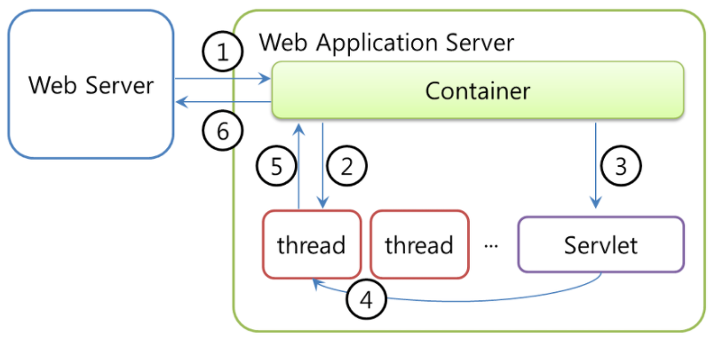
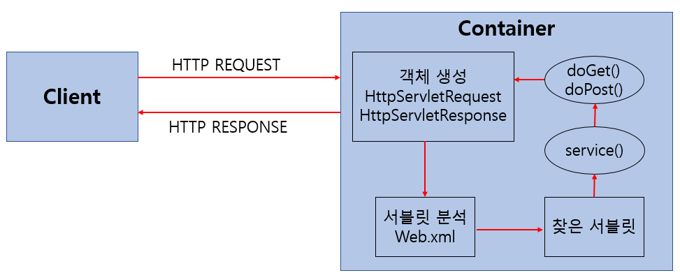

# Today I Learned
## 목표
* 공부한 내용 기록
* 2문제 이상 알고리즘 문제 풀기

## 5月

### 23日

- 웹 서버(Web Server)

    - 웹 브라우저와 같은 클라이언트로부터 HTTP 요청을 받아들이고, 웹 페이지를 정적으로 처리해 반환하는 프로그램
    - 웹 페이지를 클라이언트로 전달하고, 클라이언트로부터 컨텐츠를 전달 받는 역할
    - 종류로는 아파치, 인터넷 정보 서버, 엔터프라이즈 서버 등이 있다
    - 월드 와이드 웹 뿐만 아니라 프린터, 라우터, 웹캠과 같은 임베디드 장치, 근거리 통신망에서도 사용된다
    - 클라이언트에 추가적인 소프트웨어의 설치 없이 대부분의 운영체제에 포함된 웹 브라우저만으로 서비스를 제공할 수 있다

- 웹 어플리케이션 서버(Web Application Server)

    -  HTTP를 통해 컴퓨터나 장치에 어플리케이션을 수행해주는 미들웨어
    - 동적 서버 콘텐츠를 수행한다는 것으로 일반 웹 서버와 구별되며, 주로 데이터베이스 서버와 같이 서비스를 수행
    - 웹 서버 + 웹 컨테이너로 웹상에서 사용하는 컴포넌트를 올려놓고 사용하게 되는 서버
    - 종류로는 Web Login, Jeus, Tomcat, JBoss 등이 있다

- 자바 웹 어플리케이션(Java Web Application)

    - WAS(Web Application Server)에 설치되어 동작하는 어플리케이션
    - 자바 웹 어플리케이션에는 HTML, CSS, 이미지, 자바로 작성된 클래스(Servlet, package, 인터페이스 등), 각종 설정 파일 등이 포함
    - 자바 웹 어플리케이션 폴더 구조

- 서블릿(Servlet)

    - 클라이언트의 요청을 처리하고, 그 결과를 반환하는 Servlet 클래스의 구현 규칙을 지킨 자바 웹 프로그래밍 기술
    - html을 사용하여 요청에 응답한다
    - Java Thread를 이용하여 동작한다
    - MVC(Model View Controller) 패턴에서 Controller로 이용된다
    - HTTP 프로토콜 서비스를 지원하는 **javax.servlet.http.HttpServlet 클래스를 상속**받는다
    - UDP보다 처리속도가 느리다
    - HTML 변경시 Servlet을 재컴파일해야 하는 단점이 있다

- Servlet 동작 방식

    
    1. 사용자(클라이언트)가 URL을 입력하면 HTTP Request가 Servlet Container로 전송합니다
    2. 요청을 전송받은 Servlet Container는 HttpServletRequest, HttpServletResponse 객체를 생성합니다
    3. web.xml을 기반으로 사용자가 요청한 URL이 어느 서블릿에 대한 요청인지 찾습니다.
    4. 해당 서블릿에서 service메소드를 호출한 후 클리아언트의 GET, POST여부에 따라 doGet() 또는 doPost()를 호출합니다
    5. doGet() or doPost() 메소드는 동적 페이지를 생성한 후 HttpServletResponse객체에 응답을 보냅니다
    6. 응답이 끝나면 HttpServletRequest, HttpServletResponse 두 객체를 소멸시킵니다

- 서블릿 컨테이너(Servlet Container)

    - 클라이언트의 요청을 받아주고 응답할 수 있도록 웹서버와 소켓으로 통신하며 대표적인 예로 톰캣이 있다
    - 역할
        - 웹서버와의 통신 지원 : 서블릿과 웹 서버가 손쉽게 통신할 수 있게 해준다
        - 서블릿의 생명주기 관리
        - 멀티쓰레드 지원 및 관리 : 요청이 올 때마다 새로운 자바 쓰레드를 하나 생성하고 HTTP 서비스 메소드를 실행하고 나면 자동으로 죽게 해준다
        - 선언적인 보안 관리   
    - Servlet 생명주기
    
    1. 클라이언트의 요청이 들어오면 컨테이너느 해당 서블릿이 메모리에 있는지 확인하고 없을 경우 init() 메소드를 호출하여 적재하며 init() 메소드는 처음 한번만 실행되기 때문에 서블릿의 쓰레드에서 공통적으로 사용해야하는 것이 있다면 오버라이딩하여 구현하면 된다. 실행중 서블릿이 변경될 경우 기존 서블릿을 파괴하고 init() 메소드를 통해 새로운 내용을 다시 메모리에 적재
    2. init()이 호출된 후 클라이언트의 요청에 따라서 service() 메소드를 통해 요청에 대한 응답이 doGet()과 doPost()로 분기된다. 이때 서블릿 컨테이너가 클라이언트의 요청이 오면 가장 먼저 처리하는 과정으로 생성된 HttpServletRequest, HttpServletResponse에 의해 request와 response 객체가 제공된다
    3. 컨테이너가 서블릿에 종료 요청을 하면 destroy() 메소드가 호출되는데 한번만 실행되며 종료시에 처리해야하는 작업들은 destroy() 메소드를 오버라이딩하여 구현하면 된다