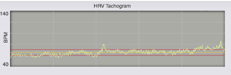
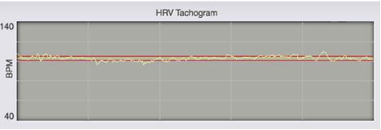
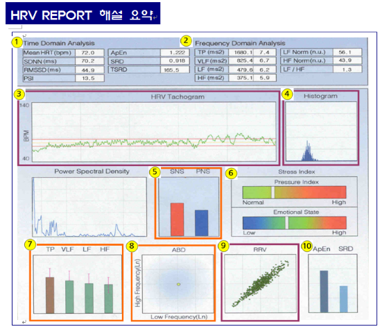
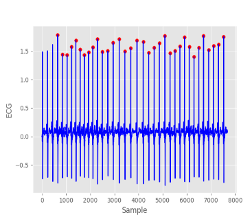

# Self_Study
## 목표
* 공부한 내용 기록
* 2문제 이상 알고리즘 문제 풀기

---
[6월](./2020/June)
---
## 7月

### 1日

- HTTP Method
    
    HTTP : HyperText Transfer Protocol의 약자로 HTML문서 등의 리소스를 전송하는 프로토콜이다.
    요청 방식으로는 여러 종류가 있지만 크롤링을 할때는 주로 get,post방식을 사용한다.
    Get 요청 : 데이터를 URL에 포함하여 전달(주로 리소스 요청에 사용)
    Post 요청 : 데이터를 Form data에 포함하여 전달(주로 로그인에 사용)


-HTML

    HTML : Hyper Text Markup Language의 약자로 웹사이트를 생성하기 위한 언어로 문서와 문서가 링크로 연결되어 있고, 태그를 사용하는 언어이다.

    태그(Tag)란?
    HTML문서의 기본 블락으로 브라우저에게 어떻게 렌더링(화면에 표시)될지 전달한다.
    (ex. <태그명 속성1 = "속성값1" 속성2="속성값2">Value</태그명>
---

### 2日

Python collection types

- List
    
    여러개의 값을 담을 수 있는 데이터 구조로 C언어에서의 배열로 생각하면 이해하기 쉽다. 생성된 후에도 변경이 가능하다.
    초기화시 var_name = [] 형식으로 []안에 값을 넣어서 초기화하거나 var_name = list(range(start,end))를 사용할 수 있다. range를 사용하면 start부터 end-1까지의 1씩 증가하는 배열이 생성된다.  
    c언어에서와 차이점이 있다면 c언어에서는 배열에서 한번에 하나씩만 원소 선택이 가능하지만 python에서는 여러 원소를 선택이 가능하다. var_name[:]을하면 처음부터 끝까지 선택되고 var_name[1:]을하면 2번째 원소부터 마지막 원소까지 var_name[1:5]을하면 2번째 원소부터 5-1 즉 4번째 원소까지 선택하는등 슬라이싱이 가능하다. var_name[1:6:2]를하면 2번 원소부터 5번 원소까지 2칸씩 뛰므로 2,4번째 원소가 선택된다. 이처럼 python에서는 리스트에서 여러 원소를 본인이 원하는 방식으로 선택할 수 있다.   
    또 C언어에서는 배열 처음 선언한 크기보다 많은 원소를 넣으려면 크기를 키워줘야하는데 python에서는 var_name.append(value)을 하면 자동으로 크기가 커지며 해당 값이 마지막 원소로 삽입되며 var,var2라는 배열이 있으면 var.extend(var2) or var + var2 실행시 var에 var2의 원소들이 추가되는 등 배열 합치기도 가능하다.  
    var.append(var2)를 실행하면 var2의 원소들로 이루어진 리스트가 var의 새로운 원소로 추가된다. ([1,2,3,[2,3,4]])  
    insert함수를 통해 원하는 위치에 원하는 값을 추가하는 것도 가능하다. var.insert(1,40)하면 1번위치에 40의 값이 추가된다.  
    python에서는 배열 원소를 삭제도 가능하다. var.remove(value)를 하면 value와 일치하는 원소가 있을 시 해당 원소를 삭제한다.  
    var.pop()을 하면 배열의 마지막 값을 반환하고 지우는데 괄호 안에 숫자를 넣으면 해당 위치에 존재하는 함수를 반환하고 지운다.  
    in함수를 사용하면 해당 배열에 내가 찾는 값이 존재하는지도 알 수 있다. var = [1,2,3]일 때
    c = a in var를 사용하면 만약 a가 1,2,3중에 하나이면 var배열 안에 존재하므로 true가 반환되고 1,2,3이 아닌 다른 값인 경우 존재하지 않으므로 false가 반환된다.  
    sort함수를 통해 정렬도 가능하다. var.sort()를 사용하면 오름차순으로 정렬되고 var.sort(reverse=True)를 사용하면 내림차순으로 정렬할 수 있다.


- Tuple

    list와 같이 여러개의 값을 담을 수 있는 데이터 구조이나 생성된 후에는 변경이 불가능하다 c언어에서 const로 생각하면 될 것 같다.
    초기화시 var_name = () 형식으로 리스트와 초기화 방법은 비슷하지만 []가 아닌 ()로 선언하는것의 차이점이 있다. 또한 var_name = val1, val2등 ()를 생략하고 초기화할 수도 있다.

- Dictionary

    c에서 해시처럼 key와 value로 이루어진 데이터 구조로 var = {key1 : val1, key2 : val2}처럼 {}를 사용하여 초기화한다.
    Dictionary도 list처럼 합칠 수 있는데 update함수를 사용하면 된다. var.update(var2)를하면 var2의 key,val들이 var로 들어가지는데 이때 var와 var2의 키가 겹칠 경우 var2의 key:value값으로 들어가진다.  
    삭제의 경우는 var.pop[key] 또는 del var[key]를 하면 해당 key와 일치하는 item이 삭제된다.  
    clear함수를 사용하면 해당 변수내의 item이 모두 사라진다.  
    Dictionary에서도 in함수가 사용 가능한데 list에서와 차이점이 있다면 list에서 in함수는 O(n)의 시간이 걸리지만 Dictionary에서는 O(1)의 시간이 걸린다.  
    list(var.keys())와 list(var.values()) 함수를 통해 해당 변수의 key와 value들에만 접근할수도 있다.

- Set

    수학에서의 집합과 동일한 개념으로 dictionary에서 key만 활용하는 데이터 구조로 이해하면 쉽다.
    a = {1,2,3}, b = {2,3,4} 처럼 dictionary와 같이 {}를 사용하여 초기화한다.
    a.union(b)를 하면 a와b의 합집합인 원소들이 나오고 a.intersection(b)를 사용하면 a와 b의 교집합, a.difference(b)를 하면 a에서 b와의 차집합, a.issubset(b)를 하면 부분집합이 나온다.
---

### 3日

- 조건문

    c에서와 비슷하다. 조건이 참이면 해당 문맥안으로 들어가 실행하고 아니면 다음 코드를 진행한다.  
    c에서는 if, else if, else를 사용하지만 python에서는 if, elif, else를 사용한다. 그리고 다른점이 또 있는데 c에서는 {}를 사용하여 문맥을 구분하는데 python에서는 들여쓰기로 구별한다.

```
    C언어
    if(조건) {

    }
    else if(조건) {

    }
    else {

    }

    Python
    if 조건 :
        code // if문 code
    elif 조건 :
        code // elif문 code
    else :
        code // else code
    code // 조건문 밖에 있는 code
```

- 논리

    python에서는 논리 연산을 AND,OR,NOT을 사용하며 우선순위는 다음과 같다. NOT > AND > OR  
    조건1 OR 조건2 AND 조건3 을하면 조건1 OR (조건2 AND 조건3의 결과)가 된다. OR를 먼저하려면 (조건1 OR 조건2) AND 조건3을 하면 된다.
    사용법은 c에서와 같이 조건1 AND 조건2 같이 조건2개 사이에 논리 연산자를 사용하면 된다.

- 반복문

    python 반복문엔 c와 마찬가지로 while, for가 있다. 사용법도 위와 비슷하다.
    ```
    while 조건 :
        code

    for 조건 :
        code
    ```
    
    for의 사용법이 신기한데 아래와 같은 코드를 실행해보자
    ```
    a=[1,2,3,4]
    for i in a :
        print(i)
    ```
    실행하면 i가 a의 원소 첫번째부터 자동으로 변경되어 1,2,3,4가 출력된다. a가 문자열이라하면 문자열의 첫번째 문자부터 선택되는등 배열로 이루어진것을 순회하여 반복할 수도 있다.  
    또 단순히 몇번 반복하는지 등을 반복하려면 다음과 같이 하면 n번 반복된다(0~n-1)
    ```
    for i in range(n) :
        print(n) 
    ```
    
- 함수(Function)

    python에서 함수의 사용법은 다음과 같다.
    ```
    def fuc_name(p_param) :
        code
        return n,m
    ```
    c에서는 반환하려는 타입에 따라 함수 앞에 int, float등을 쓰지만 python에서는 def로 작성하고 반환하려는 변수를 return하면 끝이다. 또 c와 달리 반환값을 여러개 할수 있는데 위의 코드에서 a,b = fun_name을 하면 2개의 값이 반환되고 2개 이상도 가능하다.  
    이때 반환값이 없고 안에서 동작만 하는 경우를 매크로(macro)라고 부르는데 c에서의 void형 함수를 생각하면 된다. 인자를 안 넘기고 디폴트값을 사용할 수도 있는데 이때 인자들은 앞에서부터 적용되기때문에 디폴트값은 인자들중 뒤에 것부터 명시해줘야 한다.
    
---

### 4日

- 람다(lambda)

    한 줄로 표현하는 함수로 c에서 매크로 함수 같은 느낌이다. 정의하는 방법은 다음 코드를 봐보자
    ```
    var = lambda x,y : x+y
    var(5,10)
    ```
    위의 코드를 실행하면 5와 10이 인자로 넘어가 5+10, 15라는 값이 반환된다. 즉 람다 앞에 변수를 두면 해당 변수가 함수가 된다.  

    람다가 유용하게 사용되는 함수들이 있는데 filter, map, reduce 등이 예다.

- Filter

    filter는 이름 그대로 필터링을 하는 것인데 사용법은 filter(func,list)처럼 첫번째 인자에 함수, 두번째 인자에 배열이 들어와서 해당 함수에 배열 값들을 넣어 참인 것들만 반환되는데 함수 자체는 filter객체이기때문에 list(filter(func,list))처럼 형변환 해줘야한다.
    ```
    arr = {1,2,3,4,5,6,7,8}
    list(filter(lambda n : n%2==0, arr))
    ```
    위의 코드를 사용하면 배열 중에 짝수인 원소들만 반환된다.

- Map

    Map은 주어진 배열에 특정 수식을 적용하여 새로운 배열을 만드는 함수로 사용법은 filter와 똑같다.
    ```
    arr = {1,2,3,4,5}
    list(map(lambda n:n**2,arr))
    ```
    위의 코드를 실행하면 1,4,9,16,25처럼 배열 내 원소들이 제곱이 되어 새로운 리스트로 만들어준다.


- Reduce

    Reduce는 앞에 두 함수와는 다르게 배열에 앞의 원소 1개씩만 다루는게 아니라 2개씩 연산을 취해 마지막에 1개로 합춰주는 함수로 사용법은 위와 같다.
    ```
    arr = {1,2,3,4}
    reduce(lambda x,y:x+y, arr)
    ```
    위 코드를 실행하면 첨엔 1+2 다음은 결과인 3+3 다음은 6+4가 되어 마지막 결과값인 10이 반환된다.
---

### 7日

HRV Report

Heart Rate(HR) : 1분당 뛰는 심박 수
Heartbeat(R-R interval) : 심박동사이의 간격  
Heart Rate Variability(HRV) : 심박변이도, 건강하면 다양하고 질병에 걸리면 잔잔해져 별 차이가 없다.  
(단기 영향 요소 :  호흡, 자율 신경계 활동 / 장기 영향 요소 : 나이, 유전, 건강, 수면 주기, 체온 등)  
교감 신경이 초조해지면(스트레스↑, 긴장, 신체 활동) 심박수(HR)가 높아지고 심박변이도(HRV)가 낮아진다.  
반대로 침착해지면(스트레스↓, 편안한 상태, 휴식) 심박수(HR)는 낮아지지만 심박변이도(HRV)가 높아진다.

정상인의 심박 변화



질병 상태의 심박 변화



건강한 사람은 위와 같이 그래프가 불규칙적이고 복잡하지만 질병에 걸린 사람의 경우 심박동의 변화가 미세하며 매우 단조롭게 나타난다.  
즉 HRV의 감소는 심박동의 변화의 복잡성이 감소되었음을 말하며 이는 체내 적응 능력의 감소를 의미한다. 이런 변화로부터 건강한 사람은 혈중 산소농도, 체온, 혈압 등에 민감하게 반응하여 빠른 시간 내에 균형을 맞추지만 그렇지 못한 질병에 걸린 사람들은 균형을 맞추지 못한다.

#### Time domain parameters

- Mean HRT(평균 심박동수 (단위 : bpm))

    서맥 : 50 이하  
    정상 : 60 ~ 90  
    빈맥 : 90 이상  

- SDNN(Standard Deviation of the NN interval)

    전체 NN 간격의 표준편차로 기록시간 동안에 심박동의 변화가 얼마나 되는지를 가늠할 수 있는 지표이다. 시간 범위 분석에서 가장 간단한 변수 중 하나로 분산의 제곱근이다.

- RMS-SD(Root Mean Square of Successive Differences)

인접한 RR간격의 차이를 제곱한 값의 평균의 제곱근으로 심장에 대한 부교감 신경 조절을 나타내는 고 주파수 영역을 평가하는데 사용한다. 즉 부교감 신경의 활동을 평가할 때 가장 흔하게 이용되는 변수다.

#### Frequency domain parameters

- Total power
    VLF, LF, HF을 포함한 5분 동안의 모든 power를 의미하며 자율 신경계 조절능력을 반영한다. 대게 만성 스트레스나 질병이 있는 경우 total power가 많이 감소되는데 이는 Time domain에서 SDNN과 유사한 의미를 가진다.

- VLF(Very Low Frequency)
    초저주파 성분이며 다양한 심폐 메커니즘과 관련되어 있다. VLF의 power는 산소 교환이 결여될 때 증가하는 것으로 LF와 HF band보다 각종의 사망원인과 관련이 깊고 낮은 경우 부정맥사와 관련이 있다는 것이 보고된 적 있다. VLF의 경우 5분 측정 방식에선 임상적인 해석을 하지 않는 경우가 많다.

- LF(Low Frequency)
    상대적인 저주파 성분으로 교감신경계와 부교감신경계의 활동을 동시에 반영하나 대부분 교감 신경 활동의 지표로 활용한다. 정신적인 스트레스와 관련이 있으며 생체 내 에너지 공급에 관여하는 교감 신경의 활동의 많은 부분을 설명 할 수 있다.
    LF band 내의 절반은 동방결절에서 영향을 받은 신호에 의한 것이라 할 수 있고, 교감 신경계는 0.1Hz이하로는 작용을 나타내지 않으나 부교감 신경계는 0.05Hz아래로 작용한다. 일반적으로 LF가 증가하는 경우 HRV는 감소한다.

- HF(High Frequency)
    상대적 고주파수 영역으로 호흡 활동과 관련 있다. 호흡주기나 RSA와 관련된 심박동의 변화와 관련이 깊어 Respiratory band라고도 하며 호흡이 느리거나 깊은 경우 보통 과다해진다.
    부교감신경계 활동의 지표로 특히 심장의 전기적인 안정도와 밀접한 관련이 있다고 한다.
    정상인의 경우 좀처럼 감소하지 않지만 지속적인 스트레스나 공포, 불안 등으로 고생하는 환자나 심장질환 시 낮게 나타난다. 보통 HF가 증가하면 전반적으로 HRV도 증가한다.

요약

① Time Domain Analysis  
    Mean HRT (bpm) : 60~90  
    - SDNN   
    50 이상 : 건강  
    30 이상 : 정상  
    20 ~ 30 : 관리 필요  
    20 이하 : 전문의 상담
    - RMSSD  
    40 이상 : 건강  
    20 ~ 40 : 정상  
    10 ~ 20 : 관리 필요  
    10 이하 : 전문의 상담

② Frequency Domain Analysis  
    TP : 1000이상 (lnTP 7이상)  
    LF/HF : 0.5~2(자율신경 균형상태 범위)

③ HRV Tachogram  
    변이도가 크고 복잡 다양 할수록 건강.

④ Histogram  
    분포가 넓을수록 건강함을 의미함.

⑤ SNS : PNS  정상 비율 => 4:6, 5:5, 6:4

⑥ Pressure Index : 하얀 bar가 녹색zone에 위치할수록 좋음  
    Emotional State : 하얀bar가 녹색zone 가운데 위치 할수록 좋음

⑦ TP, VLF, LF, HF가 I zone에 위치  
    TP 저하 : 자율신경의 활동도 및 스트레스에 대한 대처능력 저하(lnTP 6이하)  
    LF의 저하 : 급성스트레스, 피로, 에너지 저하, 불면증(lnLF 4.5이하)  
    HF의 저하 : 만성스트레스, 심장의 전기적인 안정도, 기능성 대장증후군(lnHF 4.5이하)

⑧ 녹색점이 정가운데 위치할수록 좋음

⑨ RRV : 넓게 분포할수록 건강하다.

⑩ ApEn : 높을수록 건강 (1.15이상)  
   SRD  : 측정 결과에 대한 신뢰도(0.9이상)
​


#### HRV(in Python)

    Python의 모듈중 하나로 심박변동(Heart Rate Variability)를 심전도 시계열에서 분석해준다.  
    Numpy, Matplotlib, SciPy을 같이 사용한다.

- R-peak Detection(R피크 검출)

    팬 톰킨스 알고리즘은 필터링, 적응 임계 값 및 인간 심장 생리학 기반의 기준을 사용하며 잡음과 빠르게 변화하는 다양한 ECG형태에 직면 한 QRS 복합체를 감지한다.
```
R_peak_locs = panTomkins(ECG, fs, plot = 1)
```


#### HRV 기능
- Time Domain

    R-peak Detection에 따라 이소 비트를 제거하여 NN(normal-to-normal) 간격 계열을 생성하고 시계열에서 다양한 통계 측정 값을 추출하여 심박수 선형 역학에 대한 통찰력 제공
    ```
    timeDomainFeats = timeDomain(RR_interval_series)
    ```

    Standard deviation : 표준편차  
Label : Description  
ANN	: Average NN interval  
SDNN : Standard deviation of NN intervals  
SDSD : Standard deviation of successive NN intervals  
NN50 : Number of successive NN intervals differing by more than 50 ms  
pNN50 : Proportion of successive NN intervals differing by more than 50 ms  
rMMSD : Root mean square of successive NN intervals  
MedianNN : Median of NN intervals

- Frequency Domain

    스펙트럼 분석은 HRV분석의 표준으로 NN 간격 시계열의 전력 스펙트럼 밀도(PSD : Power Spectral Density)에서 추출된다. 다양한 주파수 대역 내의 PSD는 Welch의 방법을 사용하여 추정되며 가장 일반적인 주파수 대역은 VLF, LF, HF등이 있다.
    ```
    freqDomainFeats = frequencyDomain(RR_interval_series)
    ```

    Label : Description  
VLF Power : Log of normalized spectral power between 0.003 Hz and 0.04 Hz  
LF Power : Log of normalized spectral power between 0.04 Hz and 0.15 Hz  
HF Power : Log of normalized spectral power between 0.15 Hz and 0.4 Hz  
LF/HF Ratio : Ratio between LF and HF spectral power

---

### 8日

#### NeuroKit.py

##### 생체 신호 처리

bio_process(Automated processing of bio signals, Wrapper for other bio processing functions)

neurokit.bioprocess(ecg = None, rsp = None, eda = None, emg = None, add = None, sampling_rate = 1000, age = None, sex = None, position = None, ecg_filter_type = 'FIR', ecg_filter_band = 'bandpass', ecg_filter_frequency = [3, 45], ecg_segmenter = 'hamilton', ecg_quality_model = 'default', ecg_hrv_features = [ 'time', 'frequency'], eda_alpha = 0.0008, eda_gamma = 0.01, scr_method = 'makowski', scr_treshold = 0.1, emg_names = NONE, emg_envelope_freqs = [10, 400], emg_envelope_lfreq = 4, emg_activation_treshold = 'default', emg_activation_n_above = 0.25, emg_activation_n_below = 1 )

parameters
	ecg (list or array) – ECG signal array.  
rsp (list or array) – Respiratory(호흡기) signal array.  
eda (list or array) – EDA signal array.  
EMG (list , array or DataFrame) - EMG signal array. Can include multiple channels  
add (pandas.DataFrame) – Dataframe or channels to add by concatenation(연결) to the processed dataframe
sampling_rate (int) – Sampling rate (sample / sec).  
age (float) – subject’s age.  
sex (str) – subject’s gender ("m" or "f").  
position (str) – Recording position. Compare with data like Voss et al. (2015),“supine”.  
ecg_filter_type (str) – Can be Finite Impulse Response filter( "FIR"), Butterworth filter ("butter"), Chebyshev filters ("cheby1" or "cheby2"), Elliptic ("ellip") 또는 Bessel filter (“bessel”).  
ecg_filter_band (str) – Band type, Low-pass filter (“lowpass”), High-pass filter (“highpass”), Band-pass filter (“bandpass”), Band-stop filter (“bandstop”)  
ecg_filter_frequency (int or list) – Cutoff(차단) frequency, "lowpass" or "bandpass": single frequency(int), "bandpass" or "bandstop": pair of frequencies(list).  
ecg_quality_model (str) – Path to check signal quality. "default" uses built in model  
ecg_hrv_features (list) – To compute HRV Index. Any or all of 'time', 'frequency' or 'nonlinear'  
ecg_segmenter (str) – The cardiac(심장) phase segmenter. Can be "hamilton", "gamboa", "engzee", "christov" or "ssf".  
eda_alpha (float) – cvxEDA penalization(처벌) for the sparse SMNA driver.  
eda_gamma (float) – cvxEDA penalization for the tonic spline coefficients(계수).  
scr_method (str) – SCR extraction(추출) algorithm. "makowski"(default), "kim"(biosPPy’s default) or "gamboa"(Gamboa, 2004).  
scr_treshold (float) – SCR minimum treshold(임계값)  
emg_names (list) – List of EMG channel names  
```
import neurokit as nk
bio_features = nk.bio_process(ecg=ecg_signal, rsp=ecg_signal, eda=eda_signal)
```

ecg_process(Automated processing ECG and RSP signals)

neurokit.ecg_process(ecg, rsp=None, sampling_rate=1000, filter_type='FIR', filter_band='bandpass', filter_frequency=[3, 45], segmenter='hamilton', quality_model='default', hrv_features=['time', 'frequency'], age=None, sex=None, position=None)

parameter
	ecg (list or ndarray) – ECG signal array.  
rsp (list or ndarray) – Respiratory(RSP) signal array.  
sampling_rate (int) – Sampling rate (samples/second).  
filter_type (str) – Can be Finite Impulse Response filter (“FIR”), Butterworth filter (“butter”), Chebyshev filters (“cheby1” and “cheby2”), Elliptic filter (“ellip”) or Bessel filter (“bessel”).  
filter_band (str) – Band type, can be Low-pass filter (“lowpass”), High-pass filter (“highpass”), Band-pass filter (“bandpass”), Band-stop filter (“bandstop”).  
filter_frequency (int or list) – Cutoff frequencies, format depends on type of band: “lowpass” or “bandpass”: single frequency (int), “bandpass” or “bandstop”: pair of frequencies (list).  
segmenter (str) – The cardiac phase segmenter. Can be “hamilton”, “gamboa”, “engzee”, “christov” or “ssf”. See neurokit.ecg_preprocess() for details.  
quality_model (str) – Path to model used to check signal quality. “default” uses the builtin model.  
hrv_features (list) – What HRV indices to compute. Any or all of ‘time’, ‘frequency’ or ‘nonlinear’.  
age (float) – Subject’s age for adjusted HRV.  
sex (str) – Subject’s gender (“m” or “f”) for adjusted HRV.  
position (str) – Recording position. To compare with data from Voss et al. (2015), use “supine”.  

```
import neurokit as nk
processed_ecg = nk.ecg_process(ecg_signal, resp_signal)
```

ecg_preprocess(ECG signal preprocessing)

neurokit.ecg_preprocess(ecg, sampling_rate=1000, filter_type='FIR', filter_band='bandpass', filter_frequency=[3, 45], filter_order=0.3, segmenter='hamilton')

parameters
	ecg (list or ndarray) – ECG signal array.  
sampling_rate (int) – Sampling rate (samples/second).  
filter_type (str or None) – Can be Finite Impulse Response filter (“FIR”), Butterworth filter (“butter”), Chebyshev filters (“cheby1” and “cheby2”), Elliptic filter (“ellip”) or Bessel filter (“bessel”).  
filter_band (str) – Band type, can be Low-pass filter (“lowpass”), High-pass filter (“highpass”), Band-pass filter (“bandpass”), Band-stop filter (“bandstop”).  
filter_frequency (int or list) – Cutoff frequencies, format depends on type of band: “lowpass” or “bandpass”: single frequency (int), “bandpass” or “bandstop”: pair of frequencies (list).  
filter_order (float) – Filter order.  
segmenter (str) – The cardiac phase segmenter. Can be “hamilton”, “gamboa”, “engzee”, “christov”, “ssf” or “pekkanen”.  

```
import neurokit as nk
ecg_preprocessed = nk.ecg_preprocess(signal)
```

- ecg_hrv(computes the HRV)

neurokit.ecg_hrv(rpeaks=None, rri=None, sampling_rate=1000, hrv_features=['time', 'frequency', 'nonlinear'])

parameters
	rpeaks (list or ndarray) – R-peak location indices.
rri (list or ndarray) – RR intervals in the signal. If this argument is passed, rpeaks should not be passed.
sampling_rate (int) – Sampling rate (samples/second).
hrv_features (list) – What HRV indices to compute. Any or all of ‘time’, ‘frequency’ or ‘nonlinear’.

```
import neurokit as nk
sampling_rate = 1000
hrv = nk.bio_ecg.ecg_hrv(rpeaks=rpeaks, sampling_rate = sampling_rate)
```

ecg_rsa(Return RSA(Respiratory Sinus Arrhythmia) features)

neurokit.ecg_rsa(rpeaks, rsp, sampling_rate=1000)

parameters
	rpeaks (list or ndarray) – List of R peaks indices.  
rsp (list or ndarray) – Filtered RSP signal.  
sampling_rate (int) – Sampling rate (samples/second).  

```
import neurokit as nk
rsa = nk.ecg_rsa(rpeaks, rsp)
```
ecg_simulate(Simulates an ECG signal)

neurokit.ecg_simulate(duration=10, sampling_rate=1000, bpm=60, noise=0.01)

parameters
	duration (int) – Desired recording length.  
sampling_rate (int) – Desired sampling rate.  
bpm (int) – Desired simulated heart rate.  
noise (float) – Desired noise level.  

```
import neurokit as nk
import pandas as pd

ecg = nk.ecg_simulate(duration = 10, bpm = 60, sampling_rate = 1000, noise = 0.01)
pd.Series(ecg).plot()
```

rsp_process(Automated processing of RSP signals)

neurokit.rsp_process(rsp, sampling_rate=1000)

parameters
	rsp (list or array) – Respiratory (RSP) signal array.  
sampling_rate (int) – Sampling rate (samples/second).  

```
import neurokit as nk
processed_rsp = nk.rsp_process(rsp_signal)
```

---