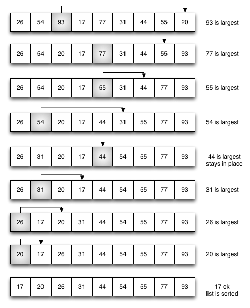
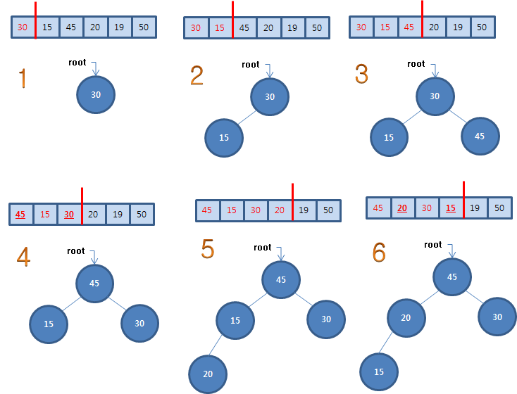
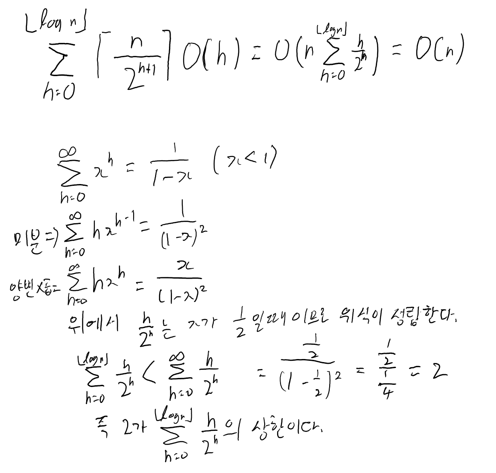

# Self_Study
## 목표
* 공부한 내용 기록
* 2문제 이상 알고리즘 문제 풀기

## 6月

* 11日

-병합정렬(mergeSort) O(n log n)

배열의 크기가 1일 될때까지 절반으로 계속 쪼개어 합칠 때 정렬을 하며, 결과적으로 원래 크기의 배열을 정렬한다.
mergesort인자로는 해당 배열,시작점,배열의 마지막 주소가 필요하며 merge의 인자로는 배열,시작점,끝점,중간점이 필요하다
병합 과정에서는 새로운 배열을 선언하여 정렬이 끝나면 정렬된 배열을 원래의 배열에 붙여넣기해야한다.
과정을 그림으로 나타내면 다음과 같다.


코드는 다음과 같다.
```
mergeSort(*arr, s, d) {
    s==d -> return
    m = (s+d)/2
    mergesort(arr, s, m)
    mergesort(arr, m+1, d)
    merge(arr, s, d, m)
}

merge(*arr, s, d, m) {
    i = s, j = m+1
    k = s ; k to d
    if arr[i]>arr[j]
        tmp[k++] = arr[j]
        j++
    else
        tmp[k++] = arr[i]
        i++
    arr = tmp
}
```

- 선택정렬(selectionSort) O(n^)

크기가 n인 배열을 첨부터 끝까지 접근하여 최대값을 찾아 배열의 n-1의 값이랑 바꾼다. 한번 수행할때마다 n-1 , n-2처럼 1씩 줄어들고
n-1번 반복하여 정렬 된다.



코드는 다음과 같다
```
selctionSort(*arr) {
    for i = arr.size - 1 ; i>0 ; j--
        max = arr[0]
        num = 0
        for j = 1 ; j<=i j++
            if arr[j]>max -> max = arr[j], num = j
        swap(arr[i],arr[num])
}
```

- 버블정렬(bubbleSort) O(n^)

버블정렬은 선택정렬과 비슷하지만 중간 과정에서 차이점이 하나있다. 선택정렬은 최대값을 찾아 마지막에 한번 swap하지만 버블정렬은 자기랑
인접한 배열과 비교하여 만약 자기가 크면 swap하고 작거나 같으면 인접한 배열에 대해 위와 같은 절차를 반복하여 정렬한다.


코드로 보면 아래와 같이 나타낼 수 있다.
```
bubblesort(*arr) {
    for i = arr.size - 1 ; i>0 ; j--
        for j = 0 ; j<i j++
            if arr[j]>arr[j+1] -> swap(arr[j],arr[j+1]
}
```

- 삽입정렬(insertionSort) O(n^)(worst, average)  O(n)(best)

삽입정렬은 새로운 배열에 배열의 처음부터 1개씩 삽입비교하여 그 배열의 위치를 찾아 정렬하는 알고리즘이다.
어떤 배열이 인자로 오는가에 따라 걸리는 시간이 크게 차이가 나는데 예를 들어 오름차순으로 정렬한다 할때 오름차순으로 정렬되어있는 배열이  
인자로 넘어오면 1번씩만 비교하면 되니 O(n)이 걸리지만 내림차순으로 정렬되어 있는 배열이 인자로 넘어오면 매번 배열의 크기만큼 검사해야해서
O(n^)이 걸린다.


코드는 다음과 같이 나타낼 수 있다.
```
insertionsort(*arr) {
    *tmp[arr.size]
    tmp[0] = arr[0]
    for i = 0; i<arr.size;i++
        for j = 0;j<=i;j++
            if arr[i]<tmp[j]
                for k = i+1;k>j;k--
                    tmp[k] = tmp[k-1]
                tmp[j] = arr[i]
                break
    *arr = *tmp
}
```

---
* 12日

- 퀵정렬(quickSort) O(n log n)(average) O(n^)(worst)

퀵 정렬은 배열안에서 하나의 기준(pivot)을 정하여 기준보다 작은 값은 왼쪽으로 기준보다 큰 값은 오른쪽으로 배치하여 기준 값의 위치를 리턴하고 이를 기준으로 좌우의 배열들에 대해 위와 같은 절차를 반복하여 정렬하는 알고리즘이다. 가장 이상적인 경우는 기준 값이 해당 배열의 중간일때 좌우로 균등하게 나눠질때 log n 만큼만 반복하면 되지만 최악의 경우 한쪽은 비어있고 반대쪽에 몰려있는 경우 n번만큼 반복해야해서 O(n^)이 걸린다.


코드는 다음과 같다.
```
quicksort(*arr , s, d) {
    if s==d return

    if(s<d)
        m = partion(arr,s,d)
        quicksort(arr,s,m)
        quicksort(arr,m+1,d)
}

partition(*arr, s, d) {
    pivot = arr[d]
    i = s
    for j=sj<d;j++
        if arr[j]<=pivot    swap(arr[j],arr[++i]) 
    swap(arr[d], arr[i+1])
}

```

- 힙정렬(heaoSort) O(n lon n)

힙정렬은 완전이진트리를 사용하여 정렬하는 알고리즘이다. 오름차순으로 정렬할때는 max heap, 내림차순으로 정렬할때는 min heap을 사용한다. 완전이진트리를 사용하는 이유는 배열을 사용하여 처리할 수 있기 때문이다.
자신의 부모노드는 자신의 위치/2를하면 되고 왼쪽 자식노드는 자신의 위치*2, 오른쪽 자식노드는 자신의 위치*2+1을 하면 알 수 있다.  
아래 사진은 오름차순 정렬을 위한 max heap을 구현한 방법이다.


사진과 같이 반복하여 힙을 생성 후 루트 값을 리턴받아 배열에 마지막에 배치하고 노드에 마지막에 있는 값을 복사하여 루트 노드에 옮기고 기존에 마지막에 있던 노드를 삭제한 후 다시 max heap을 만들어 위와 같은 작업을 반복하여 정렬한다.  
코드로 짜보면 다음과 같다.
```
heapsort(*arr, n) {
    makeheap(*arr, n)
    for i=n ; i>=2; i--
        swap(arr[i],arr[1])
        heapify(arr, 1, i-1)
}

makeheap(*arr n) {
    for i=n/2; i>=1; i--
        heapify(arr, i, n)
}

heapify(arr, k, n) {
    if(2k+1<=n) {  //자식이 둘다 있을때
        if arr[2k]>arr[k] || arr[2k+1]>arr[k] // 부모보다 큰 자식이 존재
            if arr[2k+1] > arr[2k] 
                swap(arr[2k+1], arr[k])
                heapify(arr, 2k+1, n)
            else
                swap(arr[2k],arr[k])
                heapify(arr, 2k, n)
        else return
    }
    else if(2k<=n) // 왼쪽 자식만 존재
        if arr[2k]>arr[k]
            swap(arr[2k],arr[k])
            heapify(arr, 2k, n)
    else return // 자식x
}
```
heapify의 소요 시간은 어떤 서브 트리의 높이도  log n을 넘지않으므로 O(log n)이 걸리므로 makeheap의 걸리는 시간은 전체적으론 O(n log n)이 걸린다. 하지만 이는 상한으로 잡았을 경우이다.
맨 처음 호출되는 heapify의 경우는 높이가 1이고 이런 경우가 여러가지 있다. 그 다음 레벨로 올라가면 높이가 2인 트리들을 만난다. 이를 합산해보면 O(n log n)이 아닌 O(n)이 된다.


- 선택 알고리즘(select)   O(n)(average) O(n^)(worst)

퀵정렬에서 사용한 partition을 이용해 평균 O(n)만에 i번째 크거나 작은 수를 찾는 알고리즘이다. 최악의 경우는 피봇이 한쪽에 몰려있어 매번 n-i번 만큼 검색했을 경우다.

```
select(*arr, s, d, i) {
    if p==r return a[p] // s==d일 경우 배열의 크기가 1, i 또한 1
    m = partition(arr,s,d)
    k = m-s+1 // m이 전체에서 k번째로 작은 수
    if i==k return arr[m]
    else if m>i return select(arr,s,m-1,i)
    else return select(arr, m+1, d, i-k)
}
```

- 선형시간 선택 알고리즘(linearselect)

위의 선택알고리즘과 비슷한데 다른 점이라면 위처럼 최악의 경우가 1:9같이 극단적이지 않고 3:7쯤으로 어느정도 보장해주는 알고리즘이다. 수행방법은 다음과 같다.  
1. 원소의 총 갯수가 m개 이하이면 원하는 원소를 찾고 끝낸다.(갯수는 임의로 지정하지만 보통 5를 쓴다.)  
2. 전체의 원소를 m개씩의 원소를 가진 n/m + 1 개의 그룹으로 나눈다.(n이 m의 배수일 경우는 n/m)  
3. 각 그룹에서의 중간값을 찾는다.  
4. 중간값들의 중간값을 찾는다. 만약 중간값이 홀수개면 중간이 정해지지만 짝수일 경우는 중간인 2개중 아무거나 선택한다.  
5. 최종으로 구한 중간값을 기준으로 분할한다.  
6. 적합한 곳을 골라 위의 방법을 반복한다.
---

* 13日

- 이진검색트리(BinarySearchTree) O(log n)(average)  O(n)(worst)

트리를 사용한 검색 방법으로 특정 노드를 선택했을때 그 노드보다 왼쪽에 있는 노드들의 값은 모두 선택한 노드보다 값이 작고 오른쪽에 위치한 노드들의 값은 선택한 노드보다 값이 크다. 따라서 검색을 할때 찾고자하는 값이 해당 노드 보다 크면 오른쪽으로 작으면 왼쪽으로 이동하면서 찾으면 된다. 평균적으로 O(log n)의 시간이 걸리지만 최악의 경우 O(n)의 시간이 걸린다. 노드가 한쪽으로만 쏠려있을 경우 n번만큼 검색해야하기 때문이다.

```
BinarySearchTree(node, n) {
    if node->value == n return
    else if(node->value > n) BinarySearchTree(node->right,n)
    else BinarySearchTree(node->left,n)
}

```

- 레드블랙트리(RedBlackTree)

이진검색트리를 응용한 것으로 이진검색트리에서 한쪽으로 치우치는 것을 방지하기 위해 사용한다. 이진검색트리와 다른점이라면 노드마다 빨강 또는 검정의 색깔이 있다. 색깔의 규칙은 다음과 같다.
1. 루트노드는 블랙
2. 모든 리프노드(NIL)는 블랙
3. 어떤 노드가 레드이면 그 자식 노드들은 블랙이다.
4. 어떤 노드에서 출발하여 임의의 리프노드에 이르는 경로중 만나는 블랙노드의 수는 모두 같다.


- 최소신장트리(Minimum Spanning Tree)

신장트리(Spanning Tree)란 그래프 내의 모든 정점을 포함하는 트리이며 최소 연걸 부분 그래프이다. 즉 간선의 수(V), 정점의 갯수(E)라 할때 V = E-1이어야 한다. 최소신장트리는 이때 최소 비용의 신장트리를 선택하는 것을 말한다.


- 프림 알고리즘(Prim) O(E + V log V)

프림 알고리즘은 최소신장트리(MinimumSpanningTree)의 하나로 한 정점으로부터 출발하여 신장트리 집합을 단계적으로 확장 해나가는 방법이다. 절차는 다음과 같다.
1. 처음에는 시작 정점만 트리에 들어있다.
2. 현재 갈 수 있는 간선중 최소비용인 정점을 골라 정점을 트리에 추가한다.
3. 이를 반복하여 간선이 n-1개가 되면 종료한다.


```
Prim(s, n) {// s -> 시작 정점, n -> 정점의 갯수
    for i=1; i<=n; i++ pay[i]=INF   // 모든 정점들의 비용 무한으로 초기화
    pay[s] = 0 // 시작정점의 비용 0으로 초기화
    priority_queue q 최소비용을 고르기 위해 우선순위 큐 사용
    q.push(0,s,s) // 시작 정점과 그 정점의 비용 삽입
    while(!q.empty())
        w // 중간 정점
        v // 목표 정점
        weight // 해당 간선의 가중치
        q.pop() // 최소 비용의 간선 꺼낸 후 큐에서 삭제
        
        if weight < pay[v] // 해당 경로의 비용이 더 낮다면 갱신
            pay[v] = weight
            pre[v] = w
            if linkededge == n return// 트리 내의 정점의 갯수가 n개 일시 종료
            // 목표 정점이 갈 수 있는 간선들 모두 큐에 삽입
    return; // 모든 간선을 돌아도 트리 내의 정점의 갯수가 n개가 아닐 경우
}
```

- 크루스칼 알고리즘(Kruskal) O(E log V)

크루스칼 알고리즘은 프림 알고리즘과 같이 최소신장트리의 하나로 간선들을 정렬한 후 가중치가 낮은 간선들부터 순차적으로 골라 트리를 형성한다. 이때 사이클이 형성되지 않아야 한다.


```
Kruskal(n) {
    priority_queue q // 최소 비용 위해 우선순위 큐 사용, 큐에 모든 간선 삽입
    for i=1;i<=n;i++ pay[i] = INF // 모든 정점의 비용 무한으로 초기화
    while(!q.empty) 
        w,v // 해당 간선의 양쪽 정점
        q.pop()

        if find(w,v) continue // 둘이 사이클을 도는 경우 이미 정점들의 최소비용이 결정 됬으므로 스킵
        else union(w,v) // 아닐 경우 둘을 합친다.

        if linkedge == n break // 모든 정점이 연결되면 종료
    return // 간선을 돌았지만 트리 내의 정점이 n개가 안됬을 경우
}
```

- 다익스트라 알고리즘(Dijkstra) O(|V+E| log V)

다익스트라 알고리즘은 프림 알고리즘과 많이 유사하다. 다른점이 있다면 프림 알고리즘은 가중치들의 합이 최소가 되야하지만 다익스트라는 출발 정점에서 목표 정점까지의 값이 최소가 되어야 한다.


```
Dijkstra(s,n) {// 출발정점,정점의 갯수
    for i=1;i<=n;i++ pay[i] = INF // 모든 정점 초기화
    pay[s] = 0 // 시작 정점의 비용 0으로 초기화
    priority_queue q // 최소비용을 위해 우선순위 큐 사용
    q.push(s)

    while(!q.empty)
        w // 큐에 있는 정점중 비용이 제일 작은 정점
        q.pop()
        
        for i=0;i<v[w].size();i++ // w에서 갈 수 있는 간선들의 수
            if pay[w] + weight < pay[v] pay[v] = pay[w] + weight // 기존의 값보다 중간정점을 통해 오는 값이 작으면 갱신
            w에서 갈 수 있는 모든 간선들의 비용과 정점을 q에 삽입한다.
    return // q가 비었으므로 종료
}
```